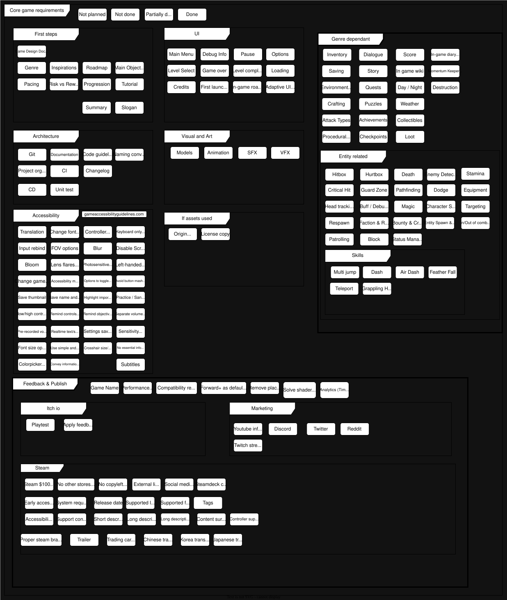

<div align="center">
<h1> <b> <i> Ludus Saltuum </b> </i> </h1>

[![Ludus Saltuum][steam_badge]][steam_url]

[![Conventional Commits][conventional_commits_badge]][conventional_commits_url]
[![Keep a Changelog][keep_changelog_badge]][keep_changelog_url]
[![Semantion Version (SemVer)][semver_badge]][semver_url]
[![Docs With Zensical][zensical_badge]][zensical_url]

[![Codeberg][godeberg_badge]][codeberg_url]
[![Gitlab][gitlab_badge]][gitlab_url]
[![Github][github_badge]][github_url]

[![Pre-commit][pre_commit_badge]][pre_commit_url]
[![git-cliff - Git Changelog Generator][git_cliff_badge]][git_cliff_url]  

[![CI][ci_badge]][ci_url]
[![Code Analysis (CodeQL)][codeql_badge]][codeql_url]  
[![GitHub version][github_release_badge]][changelog]

<h3>|
  <a href="#summary">Summary</a> |
  <a href="#developing">Developing</a> |
  <a href="#acknowledgments">Acknowledgments</a> |
</h3>
</div>

---
This was my first game, also to be partially used as a mechanics and architectural template for future games.

It took me about 5 months to release the demo. I applied a lot of what I learned in college while learning the engine and game development in general.

# Summary
Ludus Saltuum is a 3d low poly plataformer. The core game loop is a partially procedural endless runner around evolving player abilities and different mechanics.

<video width="630" height="300" src="https://github.com/user-attachments/assets/7d917f31-5a65-4a7f-8d24-22adc9bdbf6b"></video>

## Main Features:  
- No text! Everything is presented by icons, images or sound!
- Skills: Multi jump, dash, feather fall, teleport;
- Springs, tornados, car levels, mazes, portals and more;
- Coyote time, knockback;
- Checkpoint and collectibles;
- Chunk based procedural level generation (Handcrafted chunks);
- Saving system, Steam cloud, achievements;


---

<!-- TODO When finish doc as code, update this -->
## Project architecture
Uses modular approach for future proofing, relying heavily on composition and inheritance when appropriate. Any complex system is documented in `docs/diagrams/`.

Uses conventional commit messages that are fed into git-cliff to auto generate changelog. Has a few CI checks locally and on Github, also pushes to Gitlab. Has a few custom unit tests after execution.

Strictly follows [Godot's recommended code style guidelines](https://docs.godotengine.org/en/stable/tutorials/scripting/gdscript/gdscript_styleguide.html) and file naming.

<!-- TODO Finish this (Make it friendly for first time developers) -->
# Developing
### Dependencies:

- [Godot 4](https://godotengine.org/)
- [Git](https://git-scm.com/)
- [Git-lfs](https://git-lfs.com/)

```
1 - Clone this repo
2 - run: git lfs pull
3 - Scan the project's root in Godot
4 - Open the project.
```

### For commit hooks (formatter/lint/parser/spelling...) to work ([.pre-commit-config.yaml](.pre-commit-config.yaml)):

Dependencies:
- [python](https://www.python.org/)
- [pipx](https://github.com/pypa/pipx)
- [pre-commit](https://github.com/pre-commit/pre-commit)

Installing with pipx:
```bash
pipx install pre-commit
pipx ensurepath

cd <repo-path>
pre-commit install --install-hooks
pre-commit install --hook-type commit-msg
```

### To change docs (zensical)

Dependencies:
- [zensical](https://zensical.org/)

Installing with pipx:
```bash
cd <project path>
pipx install zensical
```

Running zensical locally:
```bash
zensical serve
```

### Commit guideline
Refer to [Conventional Commits](https://www.conventionalcommits.org/en/v1.0.0/).  
And this project's [configuration](git-conventional-commits.yaml).

```
<type>(<optional scope>): <description>
empty line as separator
<optional body>
empty line as separator
<optional footer>
```

### To use git-cliff (changelog generator) locally:

Dependencies:
- [pre-commit](https://github.com/pre-commit/pre-commit)
- [rust](https://rust-lang.org/tools/install/)
- [git-cliff](https://github.com/orhun/git-cliff)


[Git cliff usage examples](https://git-cliff.org/docs/usage/examples/)
<!-- TODO Improve this git cliff usage-->
```bash
git-cliff
```

# Acknowledgments
Refer to [ACKNOWLEDGMENTS.md](docs/ACKNOWLEDGMENTS.md).

<!------------------------------------------------------------->

[steam_badge]: https://img.shields.io/badge/Ludus%20Saltuum%20On%20Steam-%23232F3E.svg?logo=steam&logoColor=white
[steam_url]: https://store.steampowered.com/app/4832410/Ludus_Saltuum/

[conventional_commits_badge]: https://img.shields.io/badge/Conventional%20Commits-1.0.0-%23FE5196?logo=conventionalcommits&logoColor=white
[conventional_commits_url]: https://conventionalcommits.org

[keep_changelog_badge]: https://img.shields.io/badge/keep_a_changelog-gray?logo=keepachangelog&logoColor=E05735
[keep_changelog_url]: https://keepachangelog.com

[semver_badge]: https://img.shields.io/badge/Semantic%20Versioning-2.0.0-green?logo=semver
[semver_url]: https://semver.org/

[zensical_badge]: https://img.shields.io/badge/Docs%20With%20Zensical-gray?logo=zensical&logoColor=gray
[zensical_url]: https://zensical.org/

[godeberg_badge]: https://img.shields.io/badge/Codeberg-144B49?logo=codeberg&logoColor=white
[codeberg_url]: https://codeberg.org/leonardo-ma/Ludus-Saltuum

[gitlab_badge]: https://img.shields.io/badge/Gitlab-gray?logo=gitlab
[gitlab_url]: https://gitlab.com/Leonardo-ma/Ludus-Saltuum

[github_badge]: https://img.shields.io/badge/GitHub-181717?logo=github&logoColor=white
[github_url]: https://github.com/Leonardo-Ma/Ludus-Saltuum


[pre_commit_badge]: https://img.shields.io/badge/Pre--Commit-enabled-green?logo=pre-commit
[pre_commit_url]: https://pre-commit.com/

[git_cliff_badge]: https://img.shields.io/badge/Git--Cliff-changelog-green
[git_cliff_url]: https://git-cliff.org/

[ci_badge]: https://github.com/Leonardo-Ma/Ludus-Saltuum/actions/workflows/ci.yml/badge.svg
[ci_url]: https://github.com/Leonardo-Ma/Ludus-Saltuum/actions/workflows/ci.yml

[codeql_badge]: https://github.com/Leonardo-Ma/Ludus-Saltuum/actions/workflows/codeql.yml/badge.svg
[codeql_url]: https://github.com/Leonardo-Ma/Ludus-Saltuum/actions/workflows/codeql.yml

[github_release_badge]: https://img.shields.io/github/v/release/leonardo-ma/Ludus-Saltuum

[changelog]: ./CHANGELOG.md
