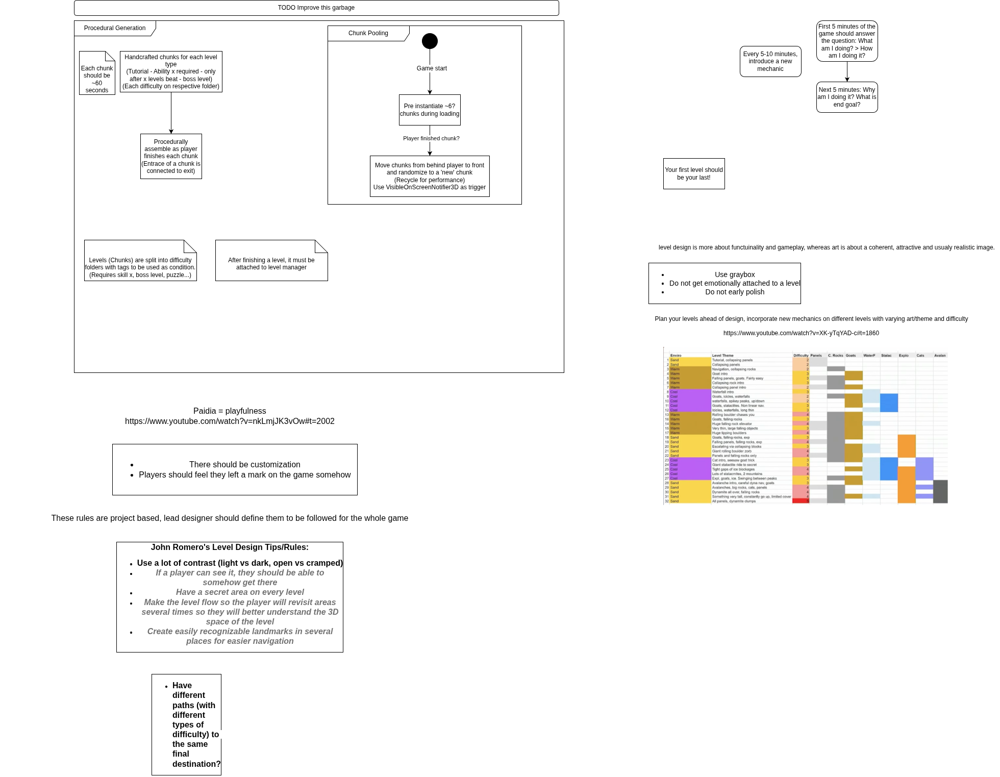

# Procedural Generation



## Deterministic generation;
- Aim for everything to be deterministic, your save system is your friend;
- Use hashes to generate a **world seed**, use the world seed as reference for other generators;
- Usually have a specific defined order of generation;

```
Example:
Generate a world_seed hash, then:
terrain_seed = hash(world_seed, "terrain") => Terrain RNG
biomes_seed  = hash(world_seed, "biomes")  => Biome RNG (BiomesGenerator)
town_seed    = hash(world_seed, "towns")   => Town RNG (TownsGenerator)
cave_seed    = hash(world_seed, "caves")   => Cave RNG (CavesGenerator)
enemies_seed = hash(world_seed, "enemies") => Enemy RNG   (EnemiesGenerator)
loot_seed    = hash(world_seed, "loot")    => Loot RNG (LootGenerator)
```
```
Or for open world chunk based (so you can generate any chunk in any order):
chunk_seed = Hash(
    world_seed,
    chunk_x,
    chunk_y,
    generation_stage
);
```
- Then use deterministic noise function (Perlin...) / seeded Pseudorandom Number Generator (PRNG) to guarantee the same input = same output.
- Optionally, only save what the player changed in the world. Like if a boss in certain place is killed, save its id with a boolean (dead = true).
